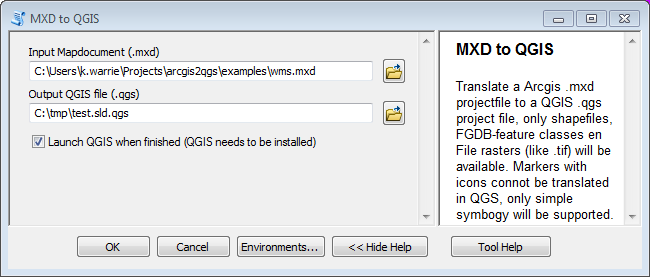

The QGIS-toolbox for Arcgis
====================

About
------

*This an ESRI python-toolbox for arcgis to convert mxd-projects to QGS-projects and layers to OGC SLD-files.
There are 2 tools in the toolbox:*

###MXD to QGIS

Translate a Arcgis .mxd projectfile to a QGIS .qgs project file, only shapefiles, 
FGDB-feature classes, WMS-services en File rasters (like .tif) will be available. 
Markers with icons connot be translated in to QGIS, so only simple symbogy will be supported.
Only single value and unique value rendering symbology for features is supported. 
Raster symbogy is also unsupported right now. 
For other types of symboly a white single value renderer will be used.
Labels wil be added but label properties are not supported.

###Layer to SLD

Convert a layer to a 'Styled Layer Descriptor', a SLD-file.
SLD is an OGC standard to store the layout of a GIS layer. 
This type of file can be imported in QGIS and Geoserver.
Only vector-layout and classified rasters are support right now.

More info about SLD-concepts can be found on the OGC website: http://www.opengeospatial.org/standards/sld .

Install / Build
-----

On the windows commandline:

Add python to path on windows, edit the arcgis version number if necessary:

    set PATH=%PATH%;C:\Python27\ArcGIS10.2

To install the library run: 

    python setup.py install
    
To create a windonws installer package:

    python setup.py bdist_wininst

The file in the dist folder kan be distributed to users.
This wil install the libraries and the arcgis tool as a arcgis system tool.

You can also just download de source and browse to the location to use the tool. 
Then you have to make sure that the al the library folders are present in the sale folder as the QGIStool.pyt file.

Remark: import SLD in QGIS
------

